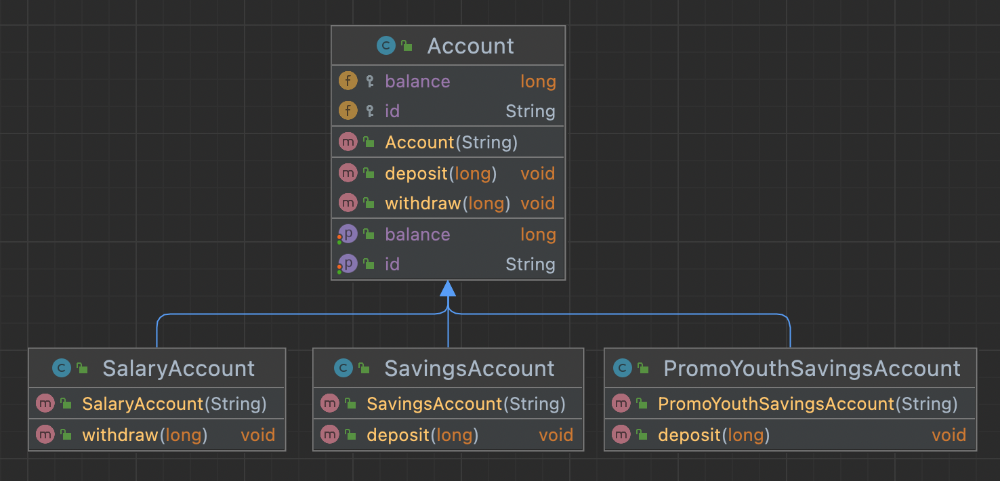
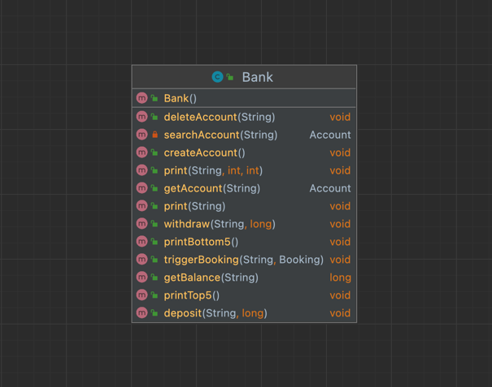

# M326 Bank

In this Readme are several different use cases and class diagrams to all Bank-tasks to find.

## Bank 2
### Class Diagram

### Use-Case
#### Account Creation
| Name            | Customer creates an account at the bank register         |
|-----------------|----------------------------------------------------------|
| Description     | The banker opens an account                              |
| Actor           | Customer, Banker                                         |
| Initiator       | The Customer wants an account                            |
| Prerequisites   | The Customer has to be allowed by law to open an account |
| Input Data      | Personal details of the customer                         |
| Result          | Confirmation of the account creation                     |
| Post-requisites | An account is opened for the customer                    |
| Process         | 1. account opened   2. confirm account               |
#### Payment
| Name            | The customer makes a payment                                                |
|-----------------|-----------------------------------------------------------------------------|
| Description     | The banker makes a payment for the customer                                 |
| Actor           | Customer, Banker                                                            |
| Initiator       | The customer wants to do a payment.                                         |
| Prerequisites   | The customer must have an account                                           |
| Input Data      | Account, Amount of Money                                                    |
| Result          | Confirmation of the payment                                                 |
| Post-requisites | The payment is done                                                         |
| Process         | 1. identify account    2. Check amount of money   3. Make a payment |
#### Bank Statement
| Name              | Customer receives the bank statement                  |
|-------------------|-------------------------------------------------------|
| Description       | The banker gives a bank statement to the customer     |
| Actor             | Customer, Banker                                      |
| Initiator         | The Customer wants a bank statement.                  |
| Prerequisites     | The customer must have an account                     |
| Input Data        | Account                                               |
| Result            | Customer receives bank statement                      |
| Post-requisites   | -                                                     |
| Process           | 1. identify account   2. give the bank statement  |
## Bank 3
### Class Diagram

#### Booking trigger
| Name            | Customer triggers a booking                     |
|-----------------|-------------------------------------------------|
| Description     | The customers shares his booking with the baker |
| Actor           | Customer, Banker                                |
| Initiator       | The Customer wants to trigger the booking       |
| Prerequisites   | The customer must have an account               |
| Input Data      | Account, Amount of money                        |
| Result          | Amount of money is deposited or withdrawed      |
| Post-requisites | -                                               |
| Process         | 1. identify account   2. trigger booking    |
## Bank 4
### Class Diagram

#### Open a Salary-, Save- and Youth savings account
| Name            | Customer opens a Salary-, Save- and Youth savings account        |
|-----------------|------------------------------------------------------------------|
| Description     | The Customer shares his prefered type of account with the banker |
| Actor           | Customer, Banker                                                 |
| Initiator       | The Customer wants to open his type of account                   |
| Prerequisites   | The customer must have an account                                |
| Input Data      | Account, type of account                                         |
| Result          | A Salary-, Save- and Youth savings account is opened             |
| Post-requisites | -                                                                |
| Process         | 1. identify customer   2. open account                       |
## Bank 5
### Class Diagram

#### Check the top 5 and the bottom 5 accounts
| Name            | A Banker wants to check the top 5 and bottom 5 accounts |
|-----------------|---------------------------------------------------------|
| Actor           | Banker                                                  |
| Initiator       | The banker wants to have an overview                    |
| Prerequisites   | minimum 5 accounts must exists                          |
| Input Data      | Filter Rule                                             |
| Result          | A list of 5 accounts                                    |
| Process         | 1. Check accounts                                   |